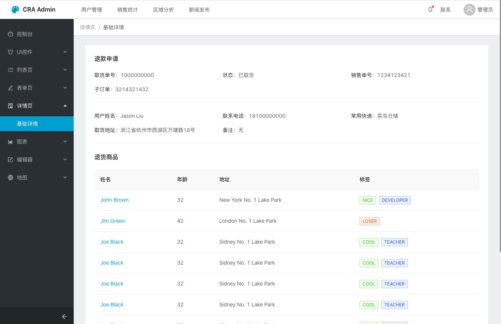

基于 CRA 的中后台系统模板。Angular 版本可以参考 [ng-admin-starter](https://github.com/fs-coder/ng-admin-starter)

## 预览
[在线预览](https://fs-coder.github.io/cra-admin-starter)


## 特性
1. 基于 [create-react-app](https://github.com/facebook/create-react-app) 创建, 代码十分精简, 没有过于复杂的配置;
1. 借助 [react-app-rewired](https://github.com/timarney/react-app-rewired) 扩展 cra 的功能, 配置文件[config-overrides](./config-overrides.js);
1. 集成了 [antd](https://github.com/ant-design/ant-design), 支持修改主题, 使用 dayjs 替代 moment 组件;
1. 集成了 [react-router](https://github.com/ReactTraining/react-router);
1. 集成了 [react-loadable](https://github.com/jamiebuilds/react-loadable), 用于实现组件懒加载;
1. 集成了 [react-lazy-load-image-component](https://github.com/Aljullu/react-lazy-load-image-component), 用于实现图片懒加载;
1. 集成了百度地图、高德地图、腾讯地图;
1. 集成了富文本编辑器 [quill](https://github.com/zenoamaro/react-quill);
1. 集成了 [Redux](https://github.com/reduxjs/redux-toolkit);
1. 内置多个常用的工具库
    + [classnames](https://github.com/JedWatson/classnames)
    + [lodash](https://github.com/lodash/lodash)
    + [dayjs](https://github.com/iamkun/dayjs)
    + [prettier](https://github.com/prettier/prettier)
1. 借助 [echarts-for-react](https://github.com/hustcc/echarts-for-react) 集成了图标库ECharts;

## 如何使用
```shell script
git clone git@github.com:fs-coder/cra-admin-starter.git
cd cra-admin-starter
yarn install
yarn run start
```

## 打包
```shell script
yarn run build
```

## LICENSE
MIT
